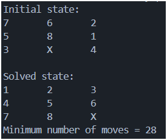
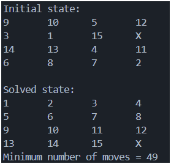

# Sliding Tile Puzzle

### Problem description:

- For an $n * n$ puzzle, the board consists of numbers 1 through $n^2$ - 1, and one empty tile represented by X.
- A move consists of moving the empty tile 'X' across the 4 directions.
- The objective is to reach the target state: number sorted accross the board

## Sliding tile puzzle solver - Version 1 (BFS algorithm)

- Version 1 is an implementation of 8-Puzzle problem using BFS - Breadth First Search algorithm.
- The goal of the puzzle is to rearrange tiles on a 3×3 board to reach the target configuration by sliding tiles into the empty space (X).
- BFS guarantees the minimum number of moves.

#### Approach used:

- Each board configuration is treated as a state.
- BFS explores all states level by level, ensuring the shortest solution path.
- States are stored as tuples (immutable and hashable) so they can be safely used in a set for tracking visited states.

#### Why we shuffled a solved board:

Instead of generating a completely random board, we shuffle an already solved puzzle to create the initial state.
- Not all 8-Puzzle configurations are solvable.
- Randomly generating states can easily lead to unsolvable puzzles.
- By applying valid moves to a solved board, we guarantee: the generated puzzle is always solvable.

This approach ensures version 1 is simple and reliable.

#### State representation:
- The state is stored as tuple of length 9.
- This makes: state comparisons fast and storage in a set efficient.

#### Version 1 limitations:

- BFS can be memory-intensive for deeper states.

## Sliding tile puzzle solver - Version 2 (A* algorithm)

This project implements a solver for the sliding tile puzzle (N×N board) using the A* search algorithm with Manhattan Distance as the heuristic function.

The project supports board sizes from 2×2 up to 4×4 and guarantees finding an optimal solution (minimum number of moves) for all solvable configurations within this range.

#### A* search algorithm:

The solver uses A*, where each state is evaluated using:

- f(n)=g(n)+h(n)
- g(n) → cost so far (number of moves)
- h(n) → heuristic estimate (Manhattan Distance)
- A priority queue (min-heap) is used to always expand the most promising state first.
- The Manhattan distance heuristic computes the sum of vertical and horizontal distances of each tile from its goal position. Admissible and consistent; guarantees optimal solutions; efficient and easy to compute.

#### Performance evaluation:

- 3×3 puzzles solve quickly
- 4×4 puzzles may take noticeable time for heavily shuffled boards
- Larger boards (e.g., 5×5) are intentionally not supported due to the exponential growth of the state space with plain A*

This limitation is a known property of the problem, not an implementation flaw.

## Key Learnings from building this project:

- State-space modeling
- Heuristic-based search
- Priority queue optimization
- Clear seperation of logic and orchestration

### Output examples:

#### This project demonstrates a complete and correct implementation of A* for the sliding tile puzzle, balancing correctness, performance, and clarity. It serves as a strong foundation for further exploration into heuristic search and AI problem-solving techniques. 

